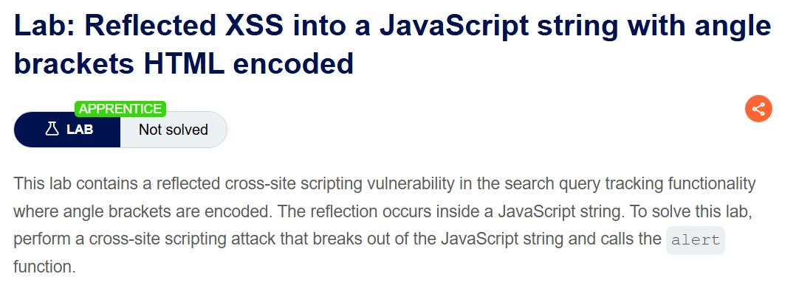
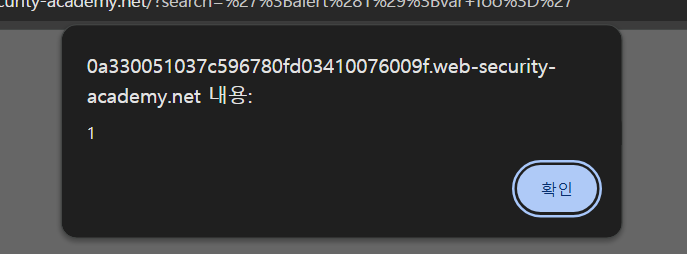
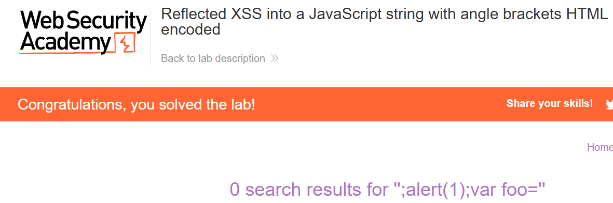

+++
date = '2026-06-03T09:00:00+09:00'
draft = false
title = '[Write-up] PortSwigger - Reflected XSS into a JavaScript string with angle brackets HTML encoded'
summary = "꺾쇠가 인코딩되지만 입력값이 JavaScript 문자열에 반사되는 환경에서 작은따옴표로 문자열을 탈출하는 Reflected XSS 풀이"
toc = true
tags = ["XSS", "Reflected XSS", "JavaScript Context", "PortSwigger", "Apprentice"]
url = '/write-up/portswigger/xss/write-up-portswigger---reflected-xss-into-a-javascript-string-with-angle-brackets-html-encoded/'
+++

---

## 문제 분석

> **난이도**: `APPRENTICE`  
> **Lab**: [Reflected XSS into a JavaScript string with angle brackets HTML encoded](https://portswigger.net/web-security/cross-site-scripting/contexts/lab-javascript-string-angle-brackets-html-encoded)

> 

검색어 추적 기능에서 입력값이 JavaScript 문자열 내부에 반사되며 꺾쇠는 HTML 인코딩된다. HTML 태그를 삽입하는 대신 JavaScript 문자열을 닫고 `alert()`를 호출하면 문제가 해결된다.

### XSS 진단

검색어로 `xss`를 입력하면 응답의 인라인 스크립트에서 다음 반사 지점을 확인할 수 있다.

```html
<script>
    var searchTerms = 'xss';
    document.write('');
</script>
```

입력값은 작은따옴표로 감싼 JavaScript 문자열 안에 들어간다. 꺾쇠의 HTML 인코딩은 태그 삽입을 막지만, JavaScript 문자열의 경계를 결정하는 작은따옴표에는 영향을 주지 않는다.

---

## 익스플로잇

기존 문자열을 닫고 독립된 문장으로 `alert()`를 호출한 뒤 남는 구문이 다시 정상적인 문자열이 되도록 페이로드를 구성한다.

```javascript
';alert(1);var foo='
```

주입 후 스크립트는 다음과 같은 형태가 된다.

```javascript
var searchTerms = '';alert(1);var foo='';
```



페이지를 로드하면 인라인 스크립트가 실행되면서 `alert()`가 호출되고 문제가 해결된다.



---

## 정리

같은 입력값이라도 HTML 본문과 JavaScript 문자열에서는 필요한 인코딩이 다르다. 꺾쇠를 HTML 인코딩하는 방어는 이 랩의 JavaScript 문자열 컨텍스트를 보호하지 못한다. 문자열 구분자와 역슬래시를 JavaScript 규칙에 맞게 처리해야 코드와 데이터를 분리할 수 있다.
