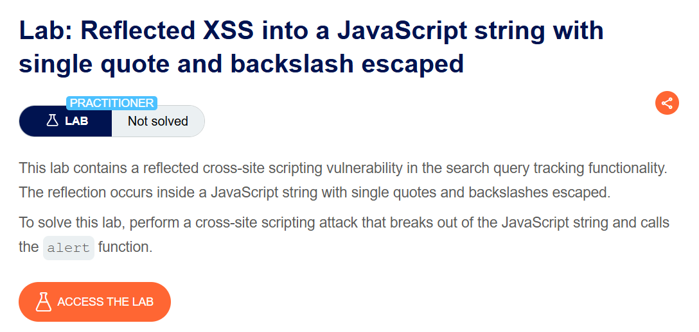
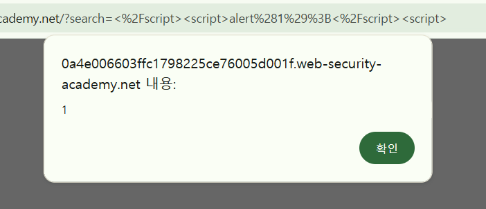

+++
date = '2026-06-05T12:00:00+09:00'
draft = false
title = '[Write-up] PortSwigger - Reflected XSS into a JavaScript string with single quote and backslash escaped'
summary = "작은따옴표와 역슬래시가 이스케이프되는 JavaScript 문자열에서 HTML 파서의 script 종료 규칙을 이용하는 Reflected XSS 풀이"
toc = true
tags = ["XSS", "Reflected XSS", "JavaScript Context", "HTML Parser", "PortSwigger", "Practitioner"]
url = '/write-up/portswigger/xss/write-up-portswigger---reflected-xss-into-a-javascript-string-with-single-quote-and-backslash-escaped/'
+++

---

## 문제 분석

> **난이도**: `PRACTITIONER`  
> **Lab**: [Reflected XSS into a JavaScript string with single quote and backslash escaped](https://portswigger.net/web-security/cross-site-scripting/contexts/lab-javascript-string-single-quote-backslash-escaped)

> 

검색어가 인라인 JavaScript의 문자열에 반사되지만 작은따옴표와 역슬래시는 모두 이스케이프된다. JavaScript 문자열 구분자를 직접 탈출하지 않고 현재 `<script>` 요소를 종료해 `alert()`를 호출하면 문제가 해결된다.

### XSS 진단

검색어의 반사 위치는 다음과 같다.

```html
<script>
    var searchTerms = 'xss';
    document.write('');
</script>
```

작은따옴표를 입력하면 `\'`, 역슬래시는 `\\`로 처리되므로 일반적인 문자열 탈출은 어렵다. 그러나 이 코드는 HTML 문서 안의 인라인 `<script>`에 존재한다.

HTML 파서는 JavaScript 문법을 완전히 이해한 뒤 태그를 찾는 것이 아니다. script data 상태에서 `</script>`를 만나면 JavaScript 문자열 내부인지와 관계없이 현재 요소를 종료한다.

---

## 익스플로잇

기존 script 요소를 닫고 새로운 script를 여는 페이로드를 입력한다.

```html
</script><script>alert(1)</script><script>
```

첫 `</script>`가 원래 인라인 스크립트를 조기에 끝내고, 새로 삽입한 `<script>alert(1)</script>`가 독립된 요소로 파싱된다. 마지막 `<script>`는 뒤에 남은 원본 코드를 감싸 HTML 구조가 크게 깨지는 것을 줄인다.



새 script 요소가 실행되면서 `alert()`가 호출되고 문제가 해결된다.


---

## 정리

인라인 JavaScript는 JavaScript 파서만이 아니라 먼저 HTML 파서의 영향을 받는다. 문자열의 작은따옴표와 역슬래시를 안전하게 처리하더라도 `<`와 `</script>`를 적절히 인코딩하지 않으면 script 요소 자체가 종료될 수 있다. 중첩된 파서 컨텍스트를 모두 고려해야 하는 대표적인 사례다.
