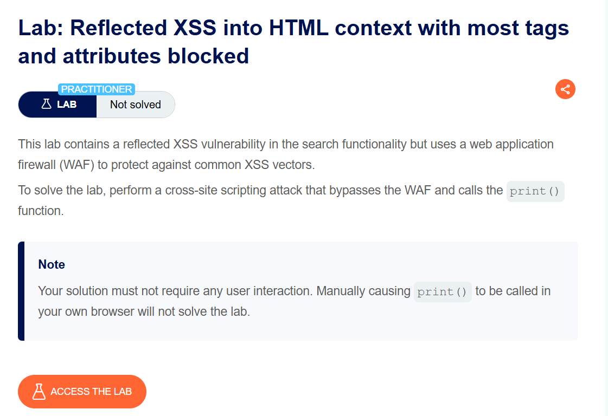
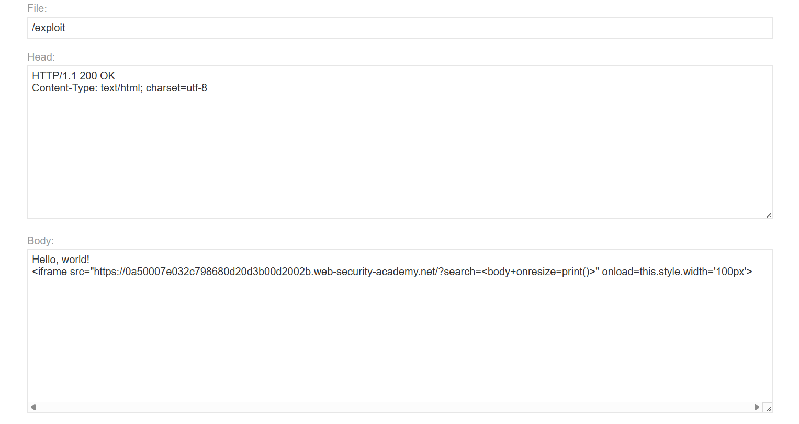
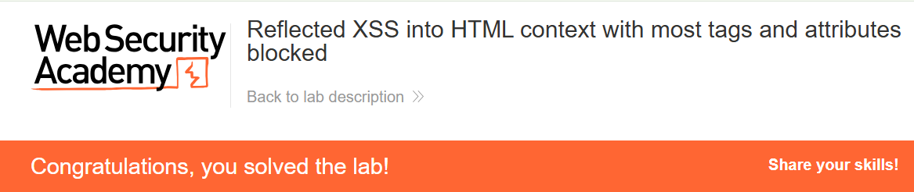

+++
date = '2026-06-04T12:00:00+09:00'
draft = false
title = '[Write-up] PortSwigger - Reflected XSS into HTML context with most tags and attributes blocked'
summary = "WAF가 허용하는 body 태그와 onresize 이벤트를 열거하고 iframe 크기 변경으로 자동 실행하는 Reflected XSS 풀이"
toc = true
tags = ["XSS", "Reflected XSS", "WAF Bypass", "PortSwigger", "Practitioner"]
url = '/write-up/portswigger/xss/write-up-portswigger---reflected-xss-into-html-context-with-most-tags-and-attributes-blocked/'
+++

---

## 문제 분석

> **난이도**: `PRACTITIONER`  
> **Lab**: [Reflected XSS into HTML context with most tags and attributes blocked](https://portswigger.net/web-security/cross-site-scripting/contexts/lab-html-context-with-most-tags-and-attributes-blocked)

> 

검색 기능에 Reflected XSS가 존재하지만 WAF가 일반적인 태그와 이벤트 속성을 차단한다. 허용된 태그와 이벤트를 찾아 사용자의 추가 동작 없이 `print()`를 호출하면 문제가 해결된다.

### XSS 진단

검색어에 `<p>xss</p>`를 입력하면 `Tag is not allowed` 응답이 반환된다. Burp Intruder에서 태그 이름을 바꾸어 응답 상태를 비교하면 대부분은 `400`으로 차단되지만 `<body>`는 `200`으로 허용된다.

같은 방식으로 `<body EVENT=1>`의 이벤트 이름을 열거하면 일반적인 이벤트는 차단되고 `onresize`는 허용되는 것을 확인할 수 있다. 따라서 다음 벡터는 WAF를 통과한다.

```html
<body onresize=print()>
```

하지만 `onresize`를 자동으로 발생시키려면 대상 문서의 뷰포트 크기를 변경할 전달 페이지가 필요하다.

---

## 익스플로잇

Exploit Server에 다음 HTML을 작성한다.

```html
<iframe
  src="https://<lab-id>.web-security-academy.net/?search=%22%3E%3Cbody%20onresize=print()%3E"
  onload="this.style.width='100px'">
</iframe>
```

대상 페이지가 iframe 안에서 로드된 후 `onload`가 iframe 너비를 변경한다. 이에 따라 내부 문서에 resize 이벤트가 발생하고, 검색어로 주입한 `<body onresize=print()>`의 핸들러가 실행된다.



익스플로잇을 피해자에게 전달하면 `print()`가 자동 호출되어 문제가 해결된다.



---

## 정리

블랙리스트 기반 WAF를 우회할 때는 태그와 속성을 추측하기보다 응답 차이를 이용해 허용 목록을 체계적으로 열거하는 편이 효율적이다. 또한 허용된 이벤트를 발견한 뒤에는 피해자의 상호작용 없이 이벤트를 발생시킬 전달 조건까지 함께 설계해야 한다.
