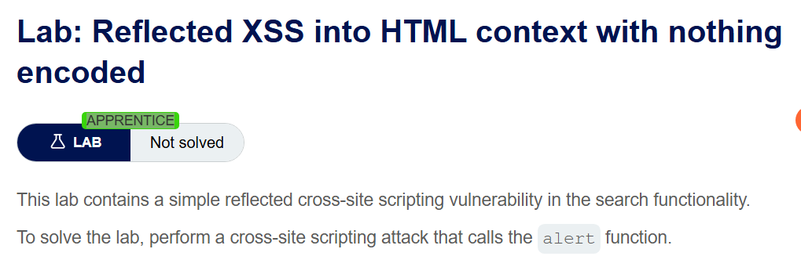
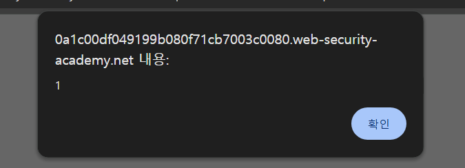
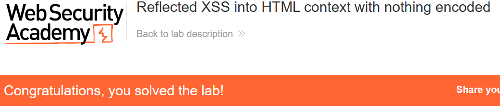

+++
date = '2026-06-01T09:00:00+09:00'
draft = false
title = '[Write-up] PortSwigger - Reflected XSS into HTML context with nothing encoded'
summary = "검색어가 인코딩 없이 HTML 본문에 반사되는 지점에 script 태그를 삽입해 JavaScript를 실행하는 기본 Reflected XSS 풀이"
toc = true
tags = ["XSS", "Reflected XSS", "PortSwigger", "Apprentice"]
url = '/write-up/portswigger/xss/write-up-portswigger---reflected-xss-into-html-context-with-nothing-encoded/'
+++

---

## 문제 분석

> **난이도**: `APPRENTICE`  
> **Lab**: [Reflected XSS into HTML context with nothing encoded](https://portswigger.net/web-security/cross-site-scripting/reflected/lab-html-context-nothing-encoded)

> 

검색 기능에서 입력한 값이 별도의 인코딩 없이 HTML 응답에 반사된다. `search` 파라미터를 통해 임의의 JavaScript를 실행해 `alert()` 함수를 호출하면 문제가 해결된다.

### XSS 진단

검색어로 고유 문자열 `xss`를 입력하고 응답을 확인하면 다음과 같이 `<h1>` 요소의 본문에 입력값이 그대로 반사된다.

```html
<h1>0 search results for 'xss'</h1>
```

입력값이 HTML 태그 사이에 위치하며 `<`, `>` 같은 메타 문자가 인코딩되지 않으므로 새로운 요소를 삽입할 수 있다.

---

## 익스플로잇

`search` 파라미터에 다음 페이로드를 입력한다.

```html
<script>alert(1)</script>
```

페이로드는 `<h1>` 내부에 실제 `<script>` 요소로 삽입된다.



브라우저가 응답을 파싱하면서 스크립트를 실행하고 `alert()`가 호출되어 문제가 해결된다.



---

## 정리

Reflected XSS는 현재 요청에 포함된 입력이 같은 요청의 응답에 안전하지 않게 포함될 때 발생한다. 이 랩은 입력값이 HTML 본문 컨텍스트에 아무런 인코딩 없이 들어가므로 태그를 새로 여는 가장 단순한 페이로드만으로 익스플로잇할 수 있다.
