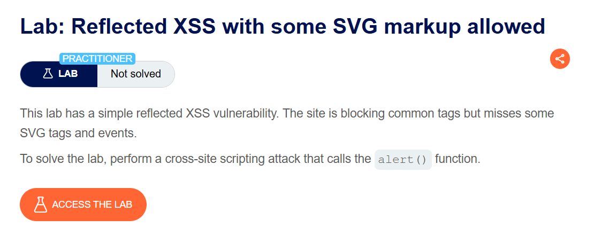
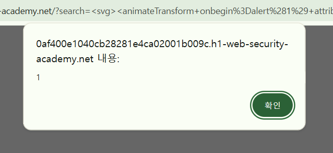
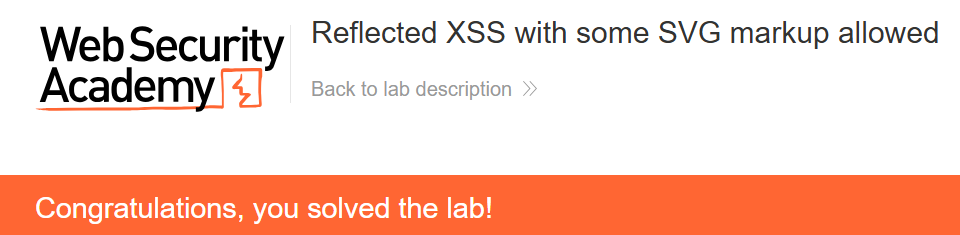

+++
date = '2026-06-04T18:00:00+09:00'
draft = false
title = '[Write-up] PortSwigger - Reflected XSS with some SVG markup allowed'
summary = "일반적인 태그와 이벤트를 차단하는 WAF에서 허용된 SVG animateTransform 요소와 onbegin 이벤트를 찾는 Reflected XSS 풀이"
toc = true
tags = ["XSS", "Reflected XSS", "SVG", "WAF Bypass", "PortSwigger", "Practitioner"]
url = '/write-up/portswigger/xss/write-up-portswigger---reflected-xss-with-some-svg-markup-allowed/'
+++

---

## 문제 분석

> **난이도**: `PRACTITIONER`  
> **Lab**: [Reflected XSS with some SVG markup allowed](https://portswigger.net/web-security/cross-site-scripting/contexts/lab-some-svg-markup-allowed)

> 

검색 기능에 Reflected XSS가 존재하지만 WAF가 일반적인 HTML 태그와 이벤트 속성을 차단한다. 필터에서 빠진 SVG 요소와 이벤트를 조합해 `alert()`를 호출하면 문제가 해결된다.

### XSS 진단

일반적인 `` 벡터는 차단된다. Burp Intruder로 태그 이름을 열거하면 `<svg>`, `<animatetransform>`, `<title>`, `<image>`는 허용되는 것을 확인할 수 있다.

허용된 `<animatetransform>` 요소에 적용할 이벤트 속성을 다시 열거하면 대부분은 차단되지만 `onbegin`은 통과한다. `onbegin`은 SVG 애니메이션이 시작될 때 발생하는 이벤트다.

---

## 익스플로잇

허용된 요소와 이벤트를 다음과 같이 조합한다.

```html
<svg><animateTransform onbegin=alert(1) attributeName=x dur=1s>
```

`attributeName`과 `dur`는 애니메이션이 시작될 수 있는 구조를 만들고, 시작 시점에 `onbegin=alert(1)`이 실행된다.



페이로드를 검색어에 입력하면 SVG 애니메이션의 시작 이벤트가 발생하면서 `alert()`가 호출되고 문제가 해결된다.



---

## 정리

HTML 중심의 블랙리스트는 SVG의 다양한 요소와 이벤트를 빠뜨리기 쉽다. 이 랩에서는 허용된 태그를 먼저 찾고, 해당 태그에 적용할 수 있는 이벤트를 두 번째로 열거해 실행 가능한 조합을 만들었다. 태그와 속성을 두 단계로 나누어 프로빙하는 방식은 필터 동작을 분석할 때 유용하다.
