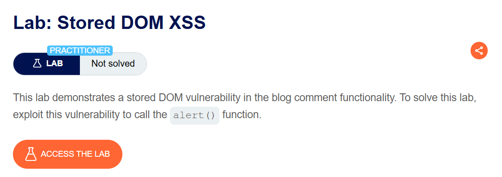
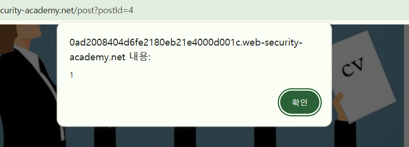
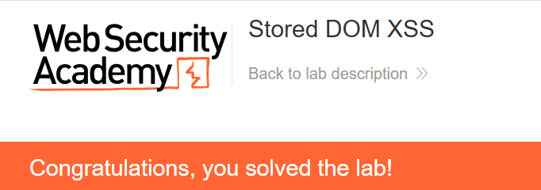

+++
date = '2026-06-04T09:00:00+09:00'
draft = false
title = '[Write-up] PortSwigger - Stored DOM XSS'
summary = "댓글 데이터를 innerHTML에 삽입하기 전 replace로 첫 꺾쇠만 치환하는 불완전한 이스케이프를 우회하는 Stored DOM XSS 풀이"
toc = true
tags = ["XSS", "DOM-Based", "Stored XSS", "innerHTML", "PortSwigger", "Practitioner"]
url = '/write-up/portswigger/xss/write-up-portswigger---stored-dom-xss/'
+++

---

## 문제 분석

> **난이도**: `PRACTITIONER`  
> **Lab**: [Stored DOM XSS](https://portswigger.net/web-security/cross-site-scripting/dom-based/lab-dom-xss-stored)

> 

댓글 데이터는 서버에 저장된 뒤 JavaScript를 통해 DOM에 렌더링된다. 클라이언트가 적용하는 불완전한 HTML 이스케이프를 우회해 `alert()`를 호출하면 문제가 해결된다.

### XSS 진단

댓글을 불러오는 `loadCommentsWithVulnerableEscapeHtml.js`에서 다음 로직을 확인할 수 있다.

```javascript
function escapeHTML(html) {
    return html.replace('<', '&lt;').replace('>', '&gt;');
}

function displayComments(comments) {
    /* 생략 */
    if (comment.body) {
        let commentBodyPElement = document.createElement('p');
        commentBodyPElement.innerHTML = escapeHTML(comment.body);
        commentSection.appendChild(commentBodyPElement);
    }
}
```

댓글 본문은 `escapeHTML()`을 거친 뒤 `innerHTML`에 대입된다. 하지만 문자열을 첫 번째 인자로 받은 `replace()`는 처음 발견한 문자 하나만 치환한다. 여러 개의 `<`, `>`를 입력하면 첫 번째 쌍 뒤에 남는 문자는 그대로 HTML 파서에 전달된다.

---

## 익스플로잇

첫 번째 꺾쇠가 이스케이프에 소비되도록 다음 댓글을 저장한다.

```html
<'>
```

첫 `<`와 첫 `>`만 각각 `&lt;`, `&gt;`로 바뀌고, 남은 `` 구조는 유효한 요소로 파싱된다. `innerHTML`로 삽입한 `<script>`는 실행되지 않으므로 로드 오류 이벤트를 사용할 수 있는 `img` 요소를 선택했다.



게시글을 조회하면 잘못된 이미지 주소가 `onerror`를 발생시키고 `alert()`가 호출되어 문제가 해결된다.



---

## 정리

Stored DOM XSS는 저장된 데이터가 클라이언트 코드의 위험한 sink를 거치면서 발생한다. 이 랩의 방어는 치환 대상 전체가 아니라 첫 문자만 처리해 쉽게 우회된다. 부분적인 문자열 치환 대신 안전한 DOM API로 텍스트를 삽입하거나 검증된 HTML sanitizer를 사용해야 한다.
