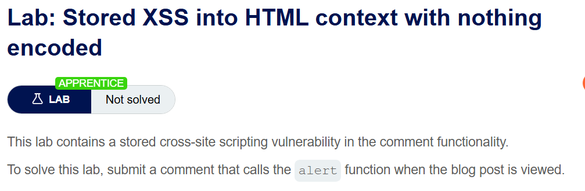
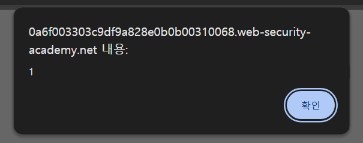
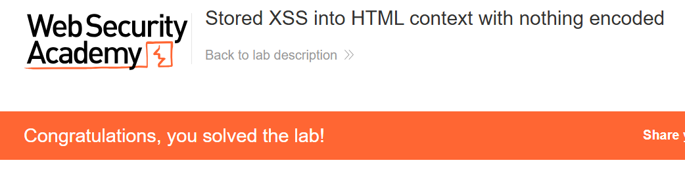

+++
date = '2026-06-01T12:00:00+09:00'
draft = false
title = '[Write-up] PortSwigger - Stored XSS into HTML context with nothing encoded'
summary = "댓글 본문에 저장된 script 태그가 게시글을 조회하는 사용자의 브라우저에서 실행되는 기본 Stored XSS 풀이"
toc = true
tags = ["XSS", "Stored XSS", "PortSwigger", "Apprentice"]
url = '/write-up/portswigger/xss/write-up-portswigger---stored-xss-into-html-context-with-nothing-encoded/'
+++

---

## 문제 분석

> **난이도**: `APPRENTICE`  
> **Lab**: [Stored XSS into HTML context with nothing encoded](https://portswigger.net/web-security/cross-site-scripting/stored/lab-html-context-nothing-encoded)

> 

블로그 댓글 기능에 Stored XSS 취약점이 존재한다. 댓글에 저장한 스크립트가 게시글을 조회할 때 실행되도록 만들어 `alert()` 함수를 호출하면 문제가 해결된다.

### XSS 진단

댓글의 이름과 본문에 고유 문자열 `xss`를 입력한 뒤 게시글 응답을 확인하면 다음과 같이 입력값이 HTML 본문에 출력된다.

```html
<section class="comment">
    <p>
         xss | 12 February 2026
    </p>
    <p>xss</p>
    <p></p>
</section>
```

댓글 본문이 서버에 저장된 후 `<p>` 요소 내부에 인코딩 없이 삽입되므로, HTML 태그를 저장하면 이후 해당 게시글을 조회하는 모든 사용자의 응답에 같은 태그가 포함된다.

---

## 익스플로잇

댓글 본문에 다음 페이로드를 저장한다.

```html
<script>alert(1)</script>
```



게시글을 다시 조회하면 저장된 댓글이 HTML 응답에 포함되고, 브라우저가 `<script>` 요소를 파싱하면서 `alert()`를 실행한다.



---

## 정리

Stored XSS는 공격 문자열이 서버에 저장되었다가 다른 요청의 응답에 포함된다는 점에서 Reflected XSS와 구분된다. 공격자가 별도의 악성 링크를 전달하지 않아도 취약한 게시글을 조회하는 사용자에게 반복적으로 영향을 줄 수 있으므로, 댓글처럼 여러 사용자가 열람하는 데이터에서는 특히 위험하다.
